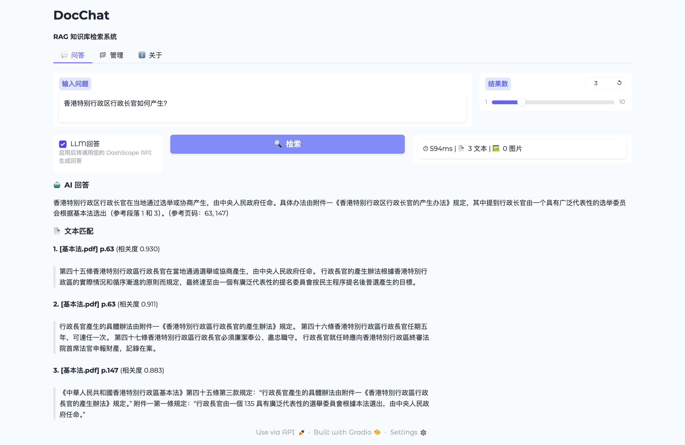
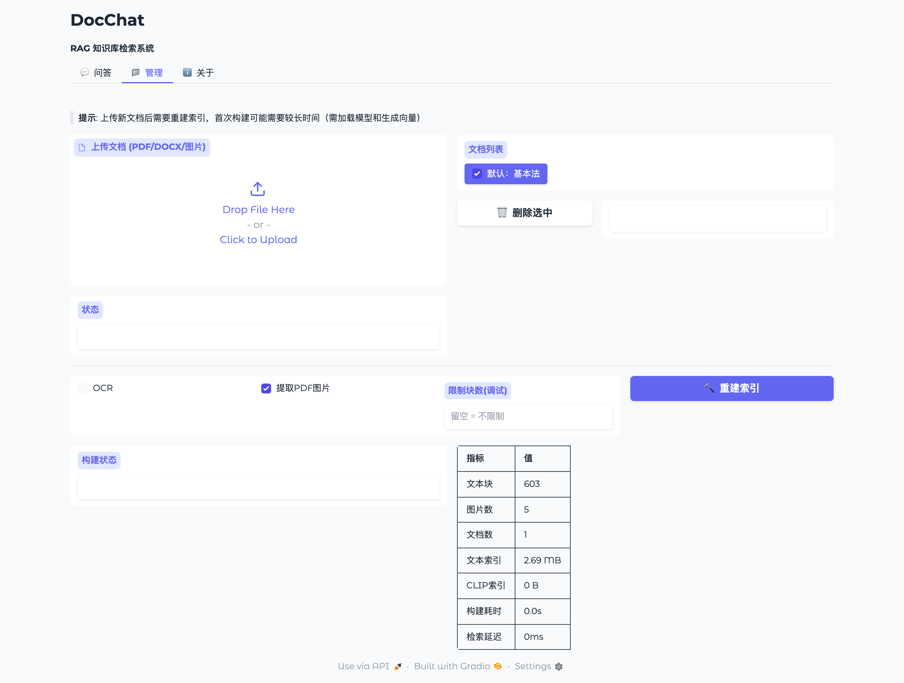
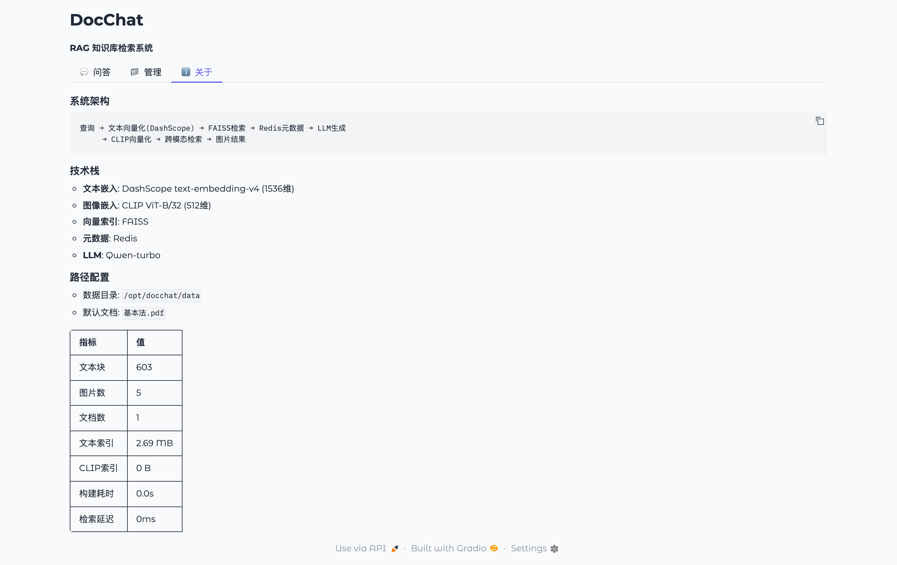

# DocChat

**中文法律文档 RAG 问答系统** —— 向量召回 + Cross-Encoder 重排 + LLM 生成，带离线评测体系。

🔗 **在线体验：[docchat.xreal.cc](https://docchat.xreal.cc)**

语料为《中华人民共和国宪法》与《香港特别行政区基本法》（188 页，603 个文本块）。



---

## 检索质量

55 题离线评测集，`top_k=5`：

| 配置 | Hit@1 | Hit@3 | Hit@5 | MRR | 平均延迟 |
|---|---|---|---|---|---|
| baseline（纯向量召回） | 0.655 | 0.818 | 0.836 | 0.737 | 782ms |
| **+ Cross-Encoder 重排** | **0.764** | 0.836 | **0.909** | **0.810** | 1256ms |

Hit@1 相对提升 **16.6%**，MRR 提升 **9.9%**，代价是延迟增加 474ms。

> 评测可复现：`python -m eval.run --top-k 5`

---

## 检索架构

```
                            ┌── 双塔粗召回（快）──┐
用户查询 ── text-embedding-v4 ─┤   FAISS 检索        ├─ top20 ─┐
                            └── 603 个文本块 ─────┘         │
                                                            ▼
                                            Cross-Encoder 精排（准）
                                                 gte-rerank-v2
                                                            │
                                                          top5
                                                            ▼
                                              Qwen 生成（带页码引用）
```

**为什么是两阶段**：召回用的双塔模型把问题和文档**分别**编码成向量再比距离，
文档向量可离线预计算，因此够快、能扛规模；代价是问题与文档从未在模型内部交互，
各自压缩成一个向量，这个信息损失是架构性的。
Cross-Encoder 把 `[问题 + 文档]` 拼接送入模型做完整注意力交互，精度显著更高，
但无法预计算，只能用于小批量候选。

**为什么不做 BM25 混合召回**：评测显示召回已接近天花板（甄别后真实 Hit@5 = 0.964），
瓶颈在排序而非召回。混合召回提升的正是召回，加了收益有限。

---

## 评测体系

RAG 是一条多环节流水线，任一环改动都可能变好或变坏。没有评测就是盲调。

**测试集构造** —— LLM 反向生成：读一段原文，出一个「只能靠这段回答」的问题，
该段的 `chunk_id` 天然就是标准答案，省掉人工标注问题与文档的对应关系。

三个易被忽略的细节：

- **均匀抽样**：本 PDF 前半是《宪法》后半是《基本法》，顺序取样会让测试集偏向一部
- **强制转简体**：LLM 会跟着繁体原文输出繁体问题，而真实用户输简体；
  若测试集用繁体，查询与文档天然同形，指标虚高
- **禁止只靠条号提问**：两部法律条号重复（宪法第五十条 vs 基本法第五十条），
  只问条号会让标准答案本身产生歧义

**指标** —— Hit@k 与 MRR。之所以两个都看：Hit@5 满分时，正确答案排第 1 与排第 5
质量完全不同，排第 5 意味着前面四条都是噪声，会挤占 LLM 上下文。Hit@k 看不出这个差别。

**未命中甄别** —— 严格的 `chunk_id` 精确匹配在语料内容重复时会**系统性低估性能**：
一个问题客观上可能有多个正确答案，但只标注了一个。
故引入温度为 0 的 LLM 裁判，对严格未命中做二次甄别，区分「真的没检索到」与
「检索对了但标签只标了另一处」。实测 9 条严格未命中中 7 条属后者。

保留严格指标用于跨版本对比（同一把尺子），甄别结果用于判断剩余改进空间。

---

## 功能特性

- **两阶段检索** —— 向量粗召回 + Cross-Encoder 精排
- **离线评测** —— 测试集生成、Hit@k / MRR、LLM 裁判甄别，一条命令出报告
- **可插拔元数据存储** —— `MetadataStore` 协议 + Redis / SQLite 双实现，
  按环境变量切换。本地零依赖启动，多实例部署可切 Redis
- **带引用生成** —— 回答末尾附参考页码
- **多格式支持** —— PDF、DOCX、图片
- **自适应 OCR** —— 扫描页可调用 Tesseract（单页失败降级跳过，不中断整份文档构建）
- **跨模态图片检索**（可选）—— 基于 CLIP，详见下方「已知限制」

### 界面

<details>
<summary>文档管理 / 关于页（点击展开）</summary>

**文档管理** —— 上传、索引重建、实时统计



**关于** —— 架构说明与运行环境



</details>

---

## 快速开始

### 环境要求

- Python 3.10+
- DashScope API Key（[申请](https://bailian.console.aliyun.com/)）
- Redis：**可选**。未安装时自动回退 SQLite
- Tesseract OCR：**可选**，仅扫描版 PDF 需要

### 安装

```bash
git clone https://github.com/EtheXReal/basiclaw-rag.git
cd basiclaw-rag

python3 -m venv .venv
source .venv/bin/activate          # Windows: .venv\Scripts\activate

pip install -r requirements.txt    # 完整版
# pip install -r deploy/requirements.lite.txt   # 轻量版：不含 CLIP，约 300MB
```

### 配置

```bash
cp .env.example .env
# 编辑 .env，至少填入 DASHSCOPE_API_KEY
```

配置一律通过 `.env` 读取，见 `.env.example` 中的完整说明。

### 运行

```bash
# 构建索引（约 1 分钟）
python main.py --rebuild

# 命令行查询
python main.py --query "行政长官如何产生？" --top-k 3

# Web 界面
python app_gradio.py     # http://127.0.0.1:7860

# 跑评测
python -m eval.testset --build -n 55    # 生成测试集（已附带，可跳过）
python -m eval.run --top-k 5            # 出评测报告
```

---

## 项目结构

```
basiclaw-rag/
├── app_gradio.py           # Gradio Web 界面
├── main.py                 # CLI 入口
├── config.py               # 全局配置（.env 读取 + 延迟校验）
├── core/pipeline.py        # 索引构建与检索主流程
│
├── embedding_manager.py    # DashScope 文本向量
├── vector_store.py         # FAISS 向量存储
├── reranker.py             # Cross-Encoder 重排
├── llm_manager.py          # LLM 回答生成
├── metadata_store.py       # 可插拔元数据存储（Protocol + Redis/SQLite）
│
├── document_loader.py      # PDF / DOCX 加载
├── pdf_loader.py           # PDF 文本与内嵌图片提取
├── text_splitter.py        # 文本分块
├── clip_manager.py         # CLIP 图像向量（可关闭）
├── clip_vector_store.py    # CLIP 向量索引
│
├── eval/                   # 评测体系
│   ├── testset.py          # LLM 反向生成测试集
│   ├── metrics.py          # Hit@k / Recall@k / MRR
│   ├── judge.py            # LLM 裁判（未命中甄别）
│   ├── run.py              # 评测入口
│   └── data/testset.jsonl  # 55 题测试集
│
└── deploy/                 # 部署
    ├── setup_ecs.sh        # Ubuntu 一键部署（systemd + 反向代理）
    └── requirements.lite.txt
```

---

## 部署

### Docker

```bash
docker compose up          # app + redis 全栈
```

⚠️ Docker 配置尚未实测，见「已知限制」。

### 服务器（当前线上采用）

```bash
export DASHSCOPE_API_KEY=sk-xxxx
bash deploy/setup_ecs.sh
```

自动完成：依赖安装 → 索引构建 → systemd 服务注册 → nginx 反向代理。

线上环境为 1.6GB 内存的小机器，采用轻量配置（`CLIP_ENABLED=false`），
常驻内存约 170MB。

---

## 已知限制

诚实记录当前状态：

- **CLIP 跨模态检索在中文场景下效果很差。** 使用的 `openai/clip-vit-base-patch32`
  是英文模型，文本侧上限 77 token，而文本块长度约 600 字，截断严重。
  且本语料仅含 5 张内嵌图片，可检索素材本就不足。
  正确做法是换 Chinese-CLIP 或 jina-clip-v2（多语言、文本侧 8192 token），
  或用 VLM 为图片生成中文描述再走普通文本检索。**线上部署已关闭此功能。**
- **无单元测试。** 有离线评测但没有单元测试，重构缺少安全网。
- **全量重建，无增量索引。** 新增一个文档会重新嵌入全部文档，既慢又耗 API 额度。
  应引入内容哈希做增量更新。
- **Gradio 应用使用全局单例存储状态**，多用户并发时会互相污染。
- **切块策略未使用文档结构。** 当前按句子聚合到固定长度，
  而法律文本有天然的「条」边界，按条切块可让引用精确到条号而非页码。
- **Docker 与 docker-compose 未实测**（开发机未安装 Docker），线上走的是脚本部署。

---

## 技术栈

| 组件 | 选型 | 说明 |
|---|---|---|
| 文本嵌入 | DashScope `text-embedding-v4` | 1024 维 |
| 重排 | DashScope `gte-rerank-v2` | Cross-Encoder |
| 向量索引 | FAISS `IndexFlatL2` | 精确检索，无近似误差 |
| 元数据 | Redis / SQLite | 可插拔，按环境变量切换 |
| LLM | `qwen-turbo` | temperature 0.2 |
| 图像嵌入 | CLIP ViT-B/32 | 512 维，可关闭 |
| Web UI | Gradio | |

---

## License

MIT

---

> 本项目用于学习与演示 RAG 系统的构建流程，回答内容不具法律效力。
