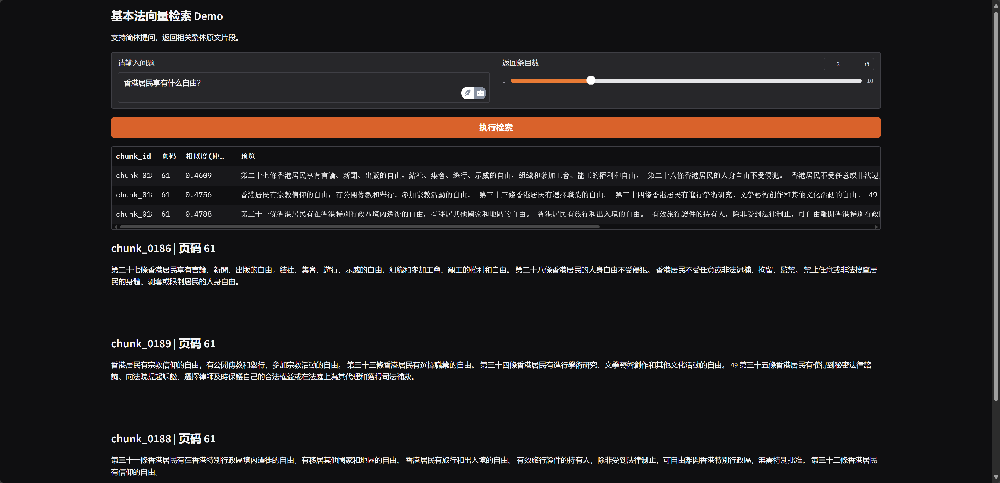

# Basic Law Vector Search

Local RAG demo built with Python + LangChain: it parses the Traditional Chinese “Basic Law” PDF, cleans and chunks sentences (`≥100` chars), generates DashScope `text-embedding-v4` embeddings into FAISS, stores metadata (chunk id / page / line / original text) in Redis, and optionally asks Qwen-turbo to summarise results. Supports both CLI and Gradio Web UI.



## Highlights
- **Traditional PDF cleaning**: PyMuPDF first, then PyPDF2 fallback; exports `processed_chunks.txt` for manual audit.
- **Sentence-level chunks**: punctuation-based splitting, removes dotted table-of-contents noise; each chunk is readable.
- **Vector search + LLM answer**: DashScope + FAISS with simplified-to-traditional query normalisation, optional Qwen-turbo summary with cited pages.
- **Metadata traceability**: Redis keeps page/line/content for every chunk.
- **Reusable core**: CLI (`main.py`) and Gradio (`app_gradio.py`) share `core/pipeline.py`.

## Requirements
- Python 3.10+
- Running Redis instance (default `localhost:6379`)
- DashScope API key (`text-embedding-v4` & `qwen-turbo`)
- Recommend ASCII-only path for FAISS data (e.g., `C:\faiss_data` on Windows)

## Quick Start
```bash
git clone https://github.com/EtheXReal/basiclaw-rag.git
cd basiclaw-rag
python -m venv .venv && .\.venv\Scripts\activate          # Windows
# source .venv/bin/activate                               # macOS / Linux
pip install -r requirements.txt

# Required
setx DASHSCOPE_API_KEY "sk-xxxxxxxx"                     # Windows (permanent)
# export DASHSCOPE_API_KEY="sk-xxxxxxxx"                 # macOS / Linux

# Optional
setx VECTOR_DATA_DIR "C:\faiss_data"
# setx REDIS_HOST "127.0.0.1"
# setx REDIS_PORT "6379"
# setx LLM_MODEL "qwen-turbo"
# setx LLM_ENABLED "true"
```
Ensure Redis is running before use.

### Build Index & Query (CLI)
```bash
python main.py --rebuild
python main.py --query "香港特首的选举流程" --top-k 3
```
CLI outputs the LLM answer (if enabled) followed by referenced chunks.

### Launch Gradio UI
```bash
python app_gradio.py
# open http://127.0.0.1:7860
```
UI contains a checkbox to toggle LLM summaries.

## Docker
```bash
docker build -t basiclaw-vector .
docker run -p 7860:7860 ^
  -e DASHSCOPE_API_KEY=sk-xxxxxxxx ^
  -e VECTOR_DATA_DIR=/app/data ^
  --add-host=host.docker.internal:host-gateway ^
  basiclaw-vector
```
Use `--add-host` if Redis runs on the host. Alternatively, create a `docker-compose.yml` to run Redis alongside.

## One-Click Setup
- Windows: `setup.ps1`
- macOS / Linux: `setup.sh`

```powershell
.\setup.ps1
```
```bash
chmod +x setup.sh
./setup.sh
```

## Key Files
- `core/pipeline.py` – main pipeline (extract → split → embed → preview)
- `text_splitter.py` – sentence cleaning & chunk export
- `llm_manager.py` – Qwen-turbo wrapper
- `main.py` / `app_gradio.py` – CLI & Gradio interfaces
- `Dockerfile`, `.env.example`, `setup.ps1`, `setup.sh`

Contributions welcome!
