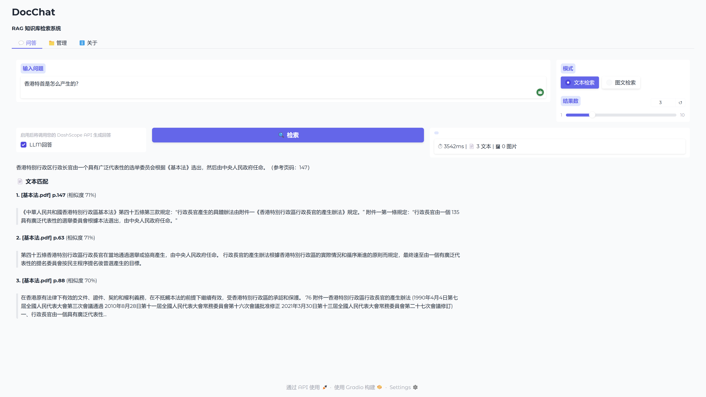
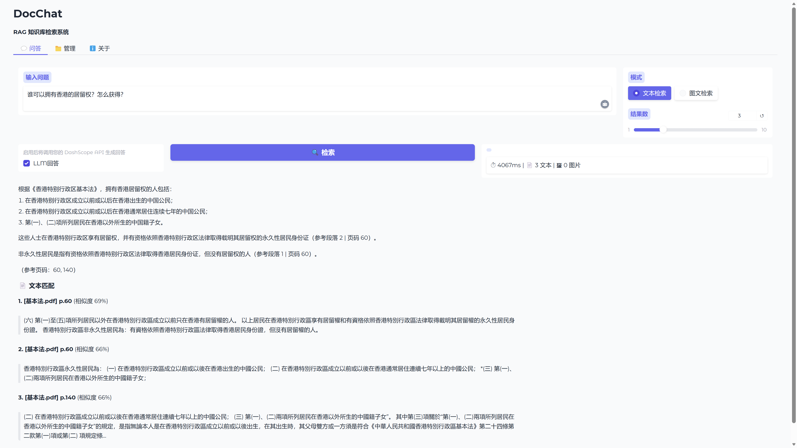
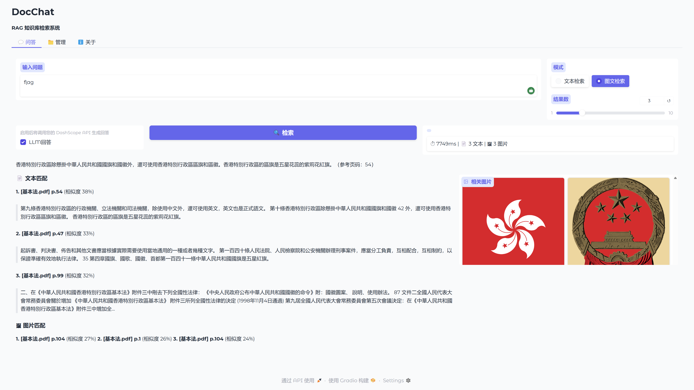
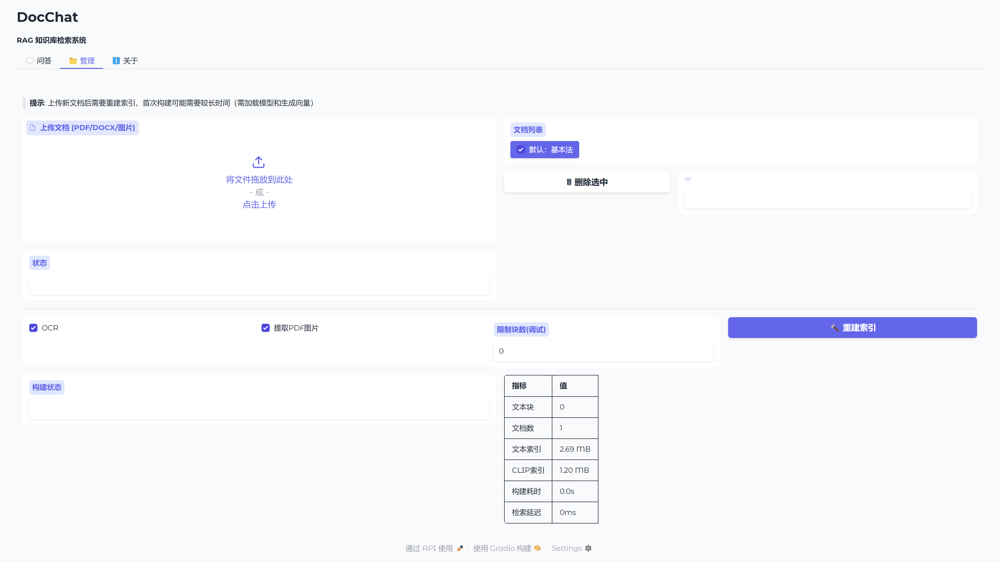
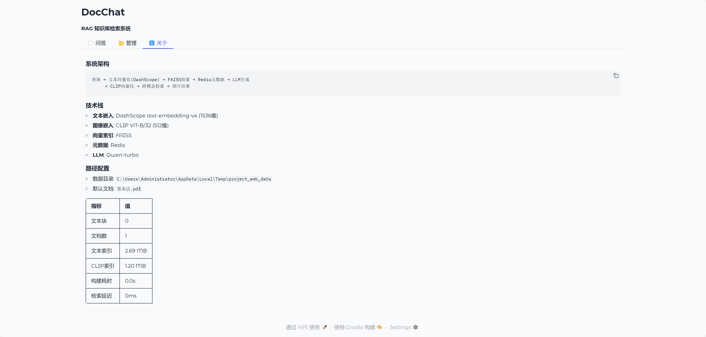

# DocChat

**RAG 知识库检索系统** — 基于向量检索与大语言模型的智能文档问答



## 功能特性

- **智能问答**：基于 RAG（检索增强生成）架构，结合向量检索与 LLM 生成准确回答
- **多模态检索**：支持文本语义搜索 + 图片跨模态检索（CLIP）
- **多格式支持**：PDF、DOCX、图片文件的统一处理与索引
- **自适应 OCR**：扫描版 PDF 自动调用 Tesseract OCR 提取文字
- **实时性能监控**：显示检索延迟、索引大小等关键指标

## 演示截图

### 文本检索与 LLM 回答


### 图文混合检索
搜索关键词可同时返回相关文本和图片：



### 文档管理
支持多文档上传、OCR 配置、索引重建：



### 系统架构


## 技术栈

| 组件 | 技术选型 |
|------|----------|
| 文本嵌入 | DashScope text-embedding-v4 (1536维) |
| 图像嵌入 | CLIP ViT-B/32 (512维) |
| 向量索引 | FAISS |
| 元数据存储 | Redis |
| LLM | Qwen-turbo |
| Web UI | Gradio |

## 系统架构

```
用户查询
    │
    ├─► 文本向量化 (DashScope) ─► FAISS 检索 ─► Redis 元数据 ─┐
    │                                                        ├─► LLM 生成回答
    └─► CLIP 向量化 ─► 跨模态检索 ─► 图片结果 ───────────────┘
```

## 快速开始

### 环境要求
- Python 3.10+
- Redis（默认 `localhost:6379`）
- DashScope API Key
- Tesseract OCR（可选，用于扫描版 PDF）

### 安装

```bash
# 克隆项目
git clone https://github.com/EtheXReal/DocChat.git
cd DocChat

# 创建虚拟环境
python -m venv .venv
.\.venv\Scripts\activate          # Windows
# source .venv/bin/activate       # macOS / Linux

# 安装依赖
pip install -r requirements.txt
```

### 配置环境变量

```bash
# 必需
set DASHSCOPE_API_KEY=sk-xxxxxxxx          # Windows
# export DASHSCOPE_API_KEY="sk-xxxxxxxx"   # macOS / Linux

# 可选
set VECTOR_DATA_DIR=C:\faiss_data
set LLM_ENABLED=true
set OCR_ENABLED=true
```

### 启动

```bash
# 启动 Web UI
python app_gradio.py
# 浏览器打开 http://127.0.0.1:7860

# 或使用 CLI
python main.py --rebuild                    # 构建索引
python main.py --query "你的问题" --top-k 3  # 查询
```

## 项目结构

```
DocChat/
├── app_gradio.py          # Gradio Web 界面
├── main.py                # CLI 入口
├── core/
│   └── pipeline.py        # 核心检索流程
├── config.py              # 全局配置
├── embedding_manager.py   # DashScope 嵌入管理
├── clip_manager.py        # CLIP 嵌入管理
├── vector_store.py        # FAISS 向量存储
├── clip_vector_store.py   # CLIP 向量存储
├── metadata_store.py      # Redis 元数据
├── llm_manager.py         # LLM 回答生成
├── document_loader.py     # 文档加载器
├── pdf_loader.py          # PDF 处理与图片提取
└── text_splitter.py       # 文本分块
```

## Docker 部署

```bash
docker build -t docchat .
docker run -p 7860:7860 \
  -e DASHSCOPE_API_KEY=sk-xxxxxxxx \
  -e VECTOR_DATA_DIR=/app/data \
  docchat
```

## License

MIT

---

> 本项目用于学习和演示 RAG 系统的构建流程。
